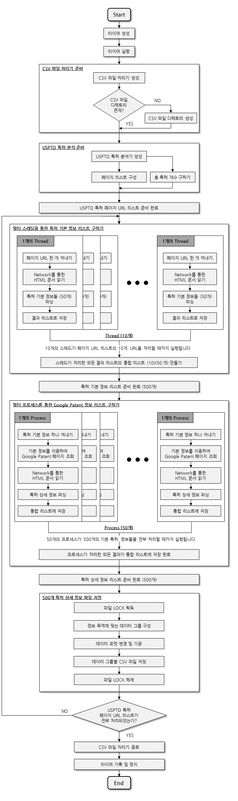

# Data-Science-Project
this project is crawling patent information using two urls  
(http://patft.uspto.gov/netacgi/nph-Parser?Sect1=PTO2&Sect2=HITOFF&u=/netahtml/PTO/search-adv.htm&r=0&p=1&f=S&l=1&Query=CPCL/G06Q%20and%20ISD/1/1/2005-%3E1/1/2017&d=PTXT),  
(https://patents.google.com/patent/[patentNumber])


# Flow-Chart Diagram(Korean)
<div>
  
</div>


# How To Run

### Download Python
you need to download Python to run this project ([donwload Python](https://www.python.org/downloads/)).  
**Note**) *have to download Python version 3+*

### Download BeautifulSoup Library
this project need to beautifulsoup library  
if you download Python done then run command interface ( if window os cmd )  
type this command and enter
```
pip install beautifulsoup
```
### Download this project file
download this project zip file and un-zip files

### Run Project
at this project root folder, run command interface and type this command and enter
```
python main.py
```


# License

MIT License

Copyright (c) 2018 Mommoo

Permission is hereby granted, free of charge, to any person obtaining a copy  
of this software and associated documentation files (the "Software"), to deal  
in the Software without restriction, including without limitation the rights  
to use, copy, modify, merge, publish, distribute, sublicense, and/or sell  
copies of the Software, and to permit persons to whom the Software is  
furnished to do so, subject to the following conditions:  

The above copyright notice and this permission notice shall be included in all  
copies or substantial portions of the Software.  

THE SOFTWARE IS PROVIDED "AS IS", WITHOUT WARRANTY OF ANY KIND, EXPRESS OR  
IMPLIED, INCLUDING BUT NOT LIMITED TO THE WARRANTIES OF MERCHANTABILITY,  
FITNESS FOR A PARTICULAR PURPOSE AND NONINFRINGEMENT. IN NO EVENT SHALL THE  
AUTHORS OR COPYRIGHT HOLDERS BE LIABLE FOR ANY CLAIM, DAMAGES OR OTHER  
LIABILITY, WHETHER IN AN ACTION OF CONTRACT, TORT OR OTHERWISE, ARISING FROM,  
OUT OF OR IN CONNECTION WITH THE SOFTWARE OR THE USE OR OTHER DEALINGS IN THE  
SOFTWARE.  
